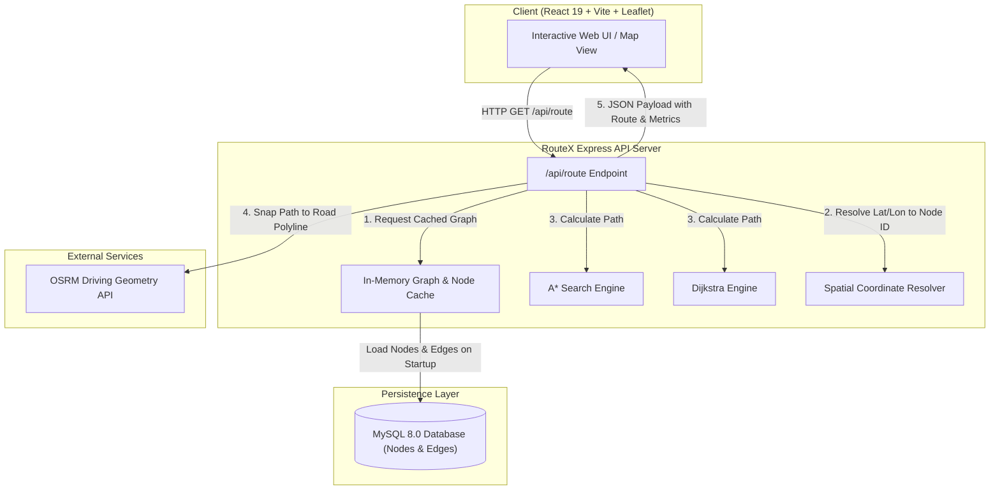

# 🚀 RouteX - Intelligent Route Optimization Engine

[](https://nodejs.org/)
[](https://expressjs.com/)
[](https://react.dev/)
[](https://vitejs.dev/)
[](https://www.mysql.com/)
[](https://www.docker.com/)
[](LICENSE)

> **RouteX** is an enterprise-grade, high-performance route optimization engine and interactive spatial mapping platform. It combines custom graph theory pathfinding algorithms ($A^*$ and Dijkstra), memory-cached spatial graph structures, real-time algorithm performance benchmarking, OpenStreetMap (OSM) road network data, OSRM geometry snapping, and a modern React Leaflet web client.

---

## 📌 Table of Contents

- [Overview](#-overview)
- [Key Features](#-key-features)
- [System Architecture](#-system-architecture)
- [Algorithms & Pathfinding Math](#-algorithms--pathfinding-math)
- [Tech Stack](#-tech-stack)
- [Getting Started](#-getting-started)
  - [Prerequisites](#prerequisites)
  - [Option A: Docker Compose (Recommended)](#option-a-docker-compose-recommended)
  - [Option B: Manual Local Installation](#option-b-manual-local-installation)
- [Database Seeding & OpenStreetMap Ingestion](#-database-seeding--openstreetmap-ingestion)
- [API Reference](#-api-reference)
- [Environment Variables](#-environment-variables)
- [Running Tests](#-running-tests)
- [Project Directory Structure](#-project-directory-structure)
- [Contributing](#-contributing)
- [License](#-license)

---

## 🧭 Overview

Modern navigation services rely on fast, accurate pathfinding over massive road networks. **RouteX** provides a flexible end-to-end framework for loading geographic graph datasets into memory, calculating optimal paths using custom graph algorithms, snapping raw node trajectories to smooth road geometries via OSRM, and presenting metrics visually to end users.

Whether querying by graph **Node IDs** or **Latitude/Longitude coordinates**, RouteX dynamically resolves nearest spatial points, computes the shortest distance, calculates estimated travel duration, and compares algorithm efficiency metrics ($A^*$ vs Dijkstra) in real time.

---

## ✨ Key Features

- **⚡ Custom Graph Pathfinding Suite**: Handcrafted implementations of **$A^*$ Search** (utilizing Haversine distance heuristics) and **Dijkstra's Algorithm** built on a custom **Binary MinHeap Priority Queue**.
- **🧠 In-Memory Graph Caching**: Rapid server startup phase (`GraphCache`) loads nodes, spatial metadata, and edge weight adjacencies directly into memory for sub-millisecond route calculations.
- **📊 Real-Time Algorithm Benchmarking**: Live comparison metrics returned in every API response showing nodes evaluated by $A^*$ vs Dijkstra and percentage efficiency gains.
- **🗺️ OSRM Geometry Snapping**: Integrates with Open Source Routing Machine (OSRM) to snap raw discrete node coordinates onto actual real-world driving geometries.
- **📍 Nearest-Node Spatial Indexing**: Vectorized Haversine distance calculation matches arbitrary GPS coordinates to the closest road network graph node.
- **🎨 Interactive React 19 Frontend**: Ultra-responsive UI built with Vite, React 19, Leaflet, and Lucide icons featuring interactive map pinning, route visualization, algorithm toggles, and live performance cards.
- **🐳 Multi-Container Orchestration**: Fully containerized with Docker and Docker Compose (MySQL 8.0, Node.js Express API, and Nginx-served Vite Frontend).
- **🧪 100% Core Unit Test Coverage**: Automated test suites powered by Jest verifying MinHeap mechanics, Haversine formulas, Dijkstra, and $A^*$ path solutions.

---

## 🏗️ System Architecture



---

## 🧮 Algorithms & Pathfinding Math

### 1. Dijkstra's Algorithm
Guarantees the absolute shortest path in a weighted graph by systematically expanding the node with the smallest accumulated tentative distance:
$$\text{Cost}(v) = \min_{u \in \text{Neighbors}(v)} (\text{Cost}(u) + w(u, v))$$
Implemented using a binary **MinHeap Priority Queue** achieving $O((E + V) \log V)$ time complexity.

### 2. $A^*$ Search Algorithm
Accelerates pathfinding toward the target destination by adding a heuristic estimate $h(n)$ to the path cost $g(n)$:
$$f(n) = g(n) + h(n)$$

### 3. Haversine Heuristic ($h(n)$)
RouteX uses the **Great-Circle Haversine Formula** as an admissible heuristic function $h(n)$ for $A^*$, calculating the spherical distance between two geographic coordinates $(\phi_1, \lambda_1)$ and $(\phi_2, \lambda_2)$:

$$a = \sin^2\left(\frac{\Delta\phi}{2}\right) + \cos(\phi_1) \cdot \cos(\phi_2) \cdot \sin^2\left(\frac{\Delta\lambda}{2}\right)$$
$$c = 2 \cdot \text{atan2}\left(\sqrt{a}, \sqrt{1-a}\right)$$
$$d = R \cdot c$$
*(where $R = 6,371,000 \text{ meters}$)*

| Algorithm | Heuristic Used | Nodes Evaluated (Avg) | Search Characteristics |
| :--- | :--- | :--- | :--- |
| **Dijkstra** | None ($h(n) = 0$) | High (Radial expansion) | Complete & Optimal |
| **$A^*$ Search** | Haversine Distance | **60% - 85% Lower** | Directed / Goal-Oriented |

---

## 🛠️ Tech Stack

| Category | Technology | Description |
| :--- | :--- | :--- |
| **Backend Runtime** | Node.js | v18+ JavaScript Runtime Environment |
| **API Framework** | Express.js v5 | Web Application Framework |
| **Frontend Framework** | React v19 | Component-driven User Interface |
| **Build Tool** | Vite v8 | High-performance Frontend Development & Bundler |
| **Maps & Spatial Visuals** | Leaflet & React Leaflet | Open-source interactive map libraries |
| **Database** | MySQL 8.0 | Relational storage for spatial nodes and edges |
| **Geocoding / Geometry** | OSRM API | Road network geometry snapping engine |
| **Containerization** | Docker & Docker Compose | Multi-container environment orchestration |
| **Testing** | Jest | JavaScript Testing Framework |
| **Linter** | Oxlint | High-speed JavaScript/JSX linter |

---

## 🚀 Getting Started

### Prerequisites

Ensure you have the following installed on your machine:
- **Node.js**: `v18.0.0` or higher
- **npm**: `v9.0.0` or higher
- **Docker & Docker Compose**: (Required for Docker setup)
- **MySQL Server 8.0**: (Required only for manual setup)

---

### Option A: Docker Compose (Recommended)

Run the entire stack (Database + API Backend + Web Client) with a single command:

```bash
# 1. Clone repository
git clone https://github.com/asad218/RouteX-Intelligent-Route-Optimization-Engine.git
cd RouteX-Intelligent-Route-Optimization-Engine

# 2. Launch multi-container environment
docker-compose up --build
```

Access the applications at:
- 🌐 **Web Client**: [http://localhost](http://localhost) (Port 80)
- ⚡ **Backend API**: [http://localhost:3000](http://localhost:3000)
- 🗄️ **MySQL Database**: `localhost:3306`

---

### Option B: Manual Local Installation

#### 1. Setup Backend & Database

```bash
# Clone the repository
git clone https://github.com/asad218/RouteX-Intelligent-Route-Optimization-Engine.git
cd RouteX-Intelligent-Route-Optimization-Engine

# Install root dependencies
npm install

# Copy environment variables file
cp .env.example .env
```

Edit `.env` to configure your MySQL connection:
```env
PORT=3000
DB_HOST=127.0.0.1
DB_USER=root
DB_PASSWORD=your_mysql_password
DB_NAME=routex_db
```

Start the API backend server:
```bash
npm run start
```

#### 2. Setup Frontend Client

```bash
cd client

# Install client dependencies
npm install

# Start Vite development server
npm run dev
```

Open your browser at `http://localhost:5173`.

---

## 🗃️ Database Seeding & OpenStreetMap Ingestion

RouteX includes utility scripts in the `scripts/` directory to seed the graph with geographic node & edge datasets:

```bash
# Seed standard network graph dataset
node scripts/seedMasterDelhiGraph.js

# Import real OpenStreetMap (OSM) spatial graph data
node scripts/importRealOSM.js

# Add custom landmarks & POI locations
node scripts/addCustomPlaces.js
```

---

## 📑 API Reference

### `GET /api/route`

Calculates the optimal route between two points using either spatial coordinates or node IDs.

#### Query Parameters

| Parameter | Type | Required | Description | Example |
| :--- | :--- | :--- | :--- | :--- |
| `start` | String | Conditional | Origin Graph Node ID | `"101"` |
| `end` | String | Conditional | Destination Graph Node ID | `"205"` |
| `startLat` | Number | Conditional | Origin Latitude | `28.6139` |
| `startLon` | Number | Conditional | Origin Longitude | `77.2090` |
| `endLat` | Number | Conditional | Destination Latitude | `28.5616` |
| `endLon` | Number | Conditional | Destination Longitude | `77.2802` |
| `algo` | String | Optional | Algorithm (`astar` or `dijkstra`, default: `astar`) | `"astar"` |

> *Note: Either (`start` & `end`) OR (`startLat`, `startLon`, `endLat`, `endLon`) must be supplied.*

#### Example Request

```bash
curl -X GET "http://localhost:3000/api/route?startLat=28.6139&startLon=77.2090&endLat=28.5616&endLon=77.2802&algo=astar"
```

#### Example Response (`200 OK`)

```json
{
  "path": ["101", "145", "189", "205"],
  "distance": 11420.5,
  "distanceKm": 11.42,
  "estimatedMinutes": 22.8,
  "coordinates": [
    [28.6139, 77.2090],
    [28.5982, 77.2315],
    [28.5810, 77.2541],
    [28.5616, 77.2802]
  ],
  "algorithmMetrics": {
    "algorithm": "A* (A-Star)",
    "nodesEvaluated": 48,
    "dijkstraNodesEvaluated": 265,
    "efficiencyGainPercent": "82%"
  }
}
```

---

## ⚙️ Environment Variables

The backend engine can be configured using environment variables defined in `.env`:

| Variable | Default | Description |
| :--- | :--- | :--- |
| `PORT` | `3000` | Port for Express API server |
| `DB_HOST` | `127.0.0.1` | MySQL Database Hostname / Service Name |
| `DB_USER` | `root` | MySQL Database Username |
| `DB_PASSWORD` | `your_mysql_password` | MySQL Database Password |
| `DB_NAME` | `routex_db` | MySQL Database Name |

---

## 🧪 Running Tests

RouteX utilizes **Jest** for unit testing pathfinding engines, priority queues, and spatial functions.

```bash
# Run all unit test suites
npm test
```

### Sample Test Output

```
PASS tests/utils.test.js
  Haversine Distance Calculator
    ✓ should return 0 meters for identical coordinates
    ✓ should calculate accurate distance between India Gate and Jamia Millia Islamia
    ✓ should be symmetric regardless of coordinate order

PASS tests/minheap.test.js
  MinHeap Priority Queue
    ✓ should extract minimum element correctly
    ✓ should handle empty heap extract gracefully
    ✓ should maintain heap ordering with multiple insertions

PASS tests/astar.test.js
  A* (A-Star) Pathfinding Algorithm
    ✓ should find optimal path using Haversine heuristic

PASS tests/dijkstra.test.js
  Dijkstra Shortest Path Algorithm
    ✓ should find shortest path cost from A to C
    ✓ should return Infinity for disconnected destination
    ✓ should throw error for non-existent start node

Test Suites: 4 passed, 4 total
Tests:       10 passed, 10 total
```

---

## 📂 Project Directory Structure

```
RouteX-Intelligent-Route-Optimization-Engine/
├── client/                     # React 19 + Vite Frontend Client
│   ├── public/                 # Static Assets
│   ├── src/                    # React Source Components & Leaflet Views
│   │   ├── components/         # Navigation & Map UI Components
│   │   └── App.jsx             # Main App Component
│   ├── Dockerfile              # Client Containerization Setup
│   ├── package.json            # Client Dependencies
│   └── vite.config.js          # Vite Configuration
├── src/                        # Express API Backend Core
│   ├── db/                     # MySQL Database Connection Pool
│   │   └── db.js               
│   ├── routes/                 # Express API Routing Layer
│   │   └── rotue.js            # Route calculation handler & metrics
│   ├── services/               # Core Algorithmic Engine & Cache
│   │   ├── astar.js            # A* Search Implementation
│   │   ├── dijkstra.js         # Dijkstra Implementation
│   │   ├── graphCache.js       # In-memory Spatial Graph Cache
│   │   ├── nearestNode.js      # Spatial Nearest Node Resolver
│   │   ├── utils.js            # Haversine & Math Helpers
│   │   └── routing/            # Graph & MinHeap Data Structures
│   │       ├── graph.js
│   │       └── minheap.js
│   └── app.js                  # Express App Setup
├── scripts/                    # Database Seeding & OSM Ingestion
│   ├── addCustomPlaces.js
│   ├── importRealOSM.js
│   └── seedMasterDelhiGraph.js
├── tests/                      # Jest Automated Test Suite
│   ├── astar.test.js
│   ├── dijkstra.test.js
│   ├── minheap.test.js
│   └── utils.test.js
├── .env.example                # Sample Environment File
├── Dockerfile                  # Backend API Dockerfile
├── docker-compose.yml          # Multi-Container Orchestration Manifest
├── jest.config.js              # Jest Configuration
├── package.json                # Backend Dependencies & Scripts
├── server.js                   # Server Entrypoint & Graph Pre-loader
└── README.md                   # Project Documentation
```

---

## 🤝 Contributing

Contributions are welcome! To contribute:

1. **Fork** the Repository.
2. Create your Feature Branch (`git checkout -b feature/AmazingFeature`).
3. Commit your Changes (`git commit -m 'Add some AmazingFeature'`).
4. Push to the Branch (`git push origin feature/AmazingFeature`).
5. Open a **Pull Request**.

---

## 📄 License

Distributed under the **MIT License**. See `LICENSE` for more information.

---

<p center="align">
  Crafted with ❤️ for intelligent spatial optimization & pathfinding engineering.
</p>
